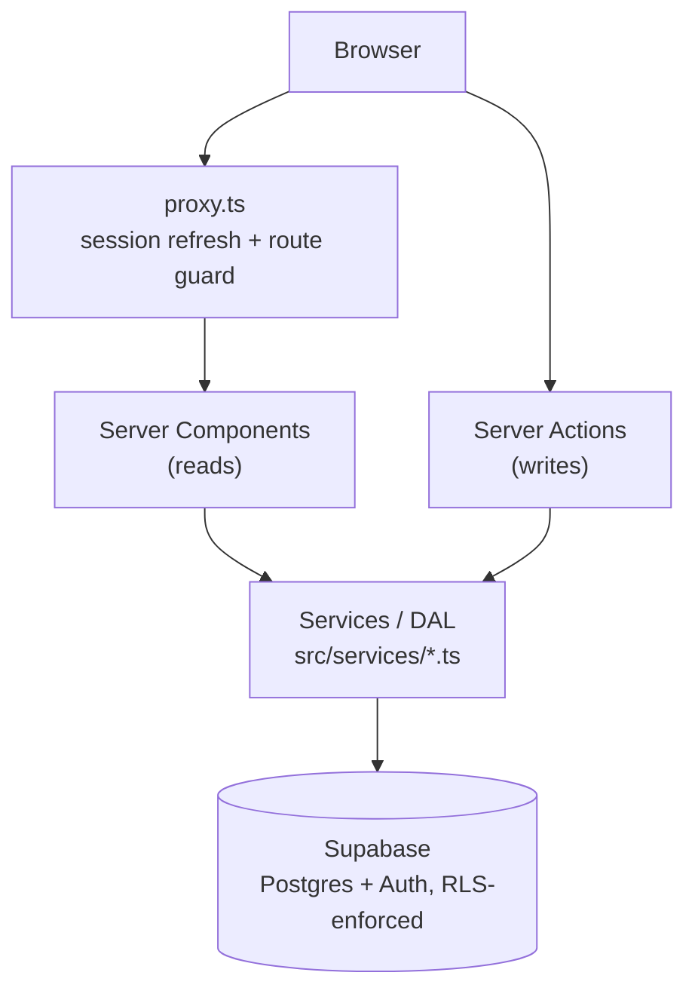

# DevFlow

DevFlow is a collaborative software development and DevOps platform that
connects the whole software lifecycle in one place:

**Idea → Project → Tasks → Code → Pull Request → CI → Security → Docker →
Deployment → Monitoring → Incident → Resolution**

It's built for university student teams, software development teams,
startups, and lecturers/project managers who need project management,
GitHub activity, CI/CD, deployments, monitoring, incidents, and team
contributions to be *connected* - not fifteen disconnected dashboards.

## The problem it solves

Most student and small-team projects end up with their process scattered
across a task board, a GitHub repo nobody looks at from the board, a CI
system nobody checks unless it turns red, and no record of what actually
happened when something broke in production. DevFlow's goal is a single,
functional system where project activity produces *real events* - a task
move, a PR merge, a pipeline failure, a deployment, an incident - all
visible in one connected timeline, with the DevOps infrastructure
progressively taking responsibility for building, testing, securing,
deploying, monitoring, and maintaining the application itself.

## How it's built

DevFlow is a **progressive DevOps learning project**: it's built in 20
numbered phases, each adding one real piece of infrastructure for a
concrete reason, with the app kept fully working after every phase. See
[`docs/devops-roadmap.md`](docs/devops-roadmap.md) for the full plan and a
running log of what problem each phase solved and what was learned
building it.

**Currently implemented: Phase 0 (architecture/foundation) and Phase 1
(MVP application).** Everything from Phase 2 onward is documented as a
plan, not yet built - the roadmap doc says exactly what's real today
versus what's coming.

## Architecture



DevFlow is a **modular monolith**: one Next.js app handles UI, data
access, and mutations, talking directly to Postgres through
Supabase using the signed-in user's own session - so row-level security,
not application code, is the real authorization boundary. See
[`docs/architecture.md`](docs/architecture.md) for the full breakdown and
[`docs/database.md`](docs/database.md) for the schema and RBAC model.

## Technology stack

| Layer            | Now (Phase 1)                                   | Later phases                              |
| ------------------ | -------------------------------------------------- | -------------------------------------------- |
| Frontend             | Next.js, React, TypeScript, Tailwind CSS, shadcn/ui   |                                              |
| Backend               | Next.js Server Actions + Route Handlers               | NestJS if/when justified, background workers  |
| Database                | PostgreSQL via Supabase                                | Redis (caching/jobs)                          |
| Auth                      | Supabase Auth                                            |                                              |
| Testing                     |                                                             | Jest, React Testing Library, Playwright        |
| Containers                    |                                                             | Docker, Docker Compose                         |
| CI/CD                           |                                                             | GitHub Actions                                 |
| Security                          |                                                             | Trivy, Semgrep, Gitleaks, Dependabot            |
| Cloud                                |                                                             | AWS                                             |
| IaC                                    |                                                             | Terraform                                        |
| Orchestration                            |                                                             | Kubernetes (Kind/Minikube → AWS EKS)              |
| Registry                                    |                                                             | GitHub Container Registry → AWS ECR                |
| Observability                                  |                                                             | Prometheus, Grafana, Loki                           |
| GitOps                                            |                                                             | Argo CD                                              |
| AI                                                   |                                                             | OpenAI API                                            |

## Local development

```bash
npm install
cp .env.example .env.local   # fill in your Supabase project's URL/keys
npm run dev                  # http://localhost:3000
```

Full setup, scripts, and coding conventions:
[`docs/development.md`](docs/development.md).

## Database

PostgreSQL via Supabase, with row-level security as the actual
authorization boundary and a five-role RBAC model (administrator, project
owner, developer, reviewer, lecturer). Schema, migrations, and the RBAC
design are documented in [`docs/database.md`](docs/database.md).

## Testing

Not implemented yet - lands in Phase 5. `npm run build`'s TypeScript check
is the only correctness gate today. See
[`docs/devops-roadmap.md`](docs/devops-roadmap.md#-phase-5---testing).

## DevOps roadmap

[`docs/devops-roadmap.md`](docs/devops-roadmap.md) - every phase from
Docker through Kubernetes, AWS, Terraform, GitOps, and observability, with
status, rationale, and lessons learned as each one ships.

## Deployment roadmap

Not deployed anywhere yet - Phase 1 runs locally against a Supabase cloud
project. The path from here (Docker → CI → security scanning → container
registry → environments → AWS → Terraform → Kubernetes → EKS → GitOps) is
in [`docs/deployment.md`](docs/deployment.md).

## Documentation

- [`docs/architecture.md`](docs/architecture.md) - layers, request flow, why a modular monolith
- [`docs/database.md`](docs/database.md) - schema, RLS, RBAC, migrations, seeding
- [`docs/development.md`](docs/development.md) - local setup, scripts, conventions
- [`docs/security.md`](docs/security.md) - authz model, secrets, what's not yet hardened
- [`docs/deployment.md`](docs/deployment.md) - current state and the deployment roadmap
- [`docs/devops-roadmap.md`](docs/devops-roadmap.md) - the phase-by-phase plan and log
