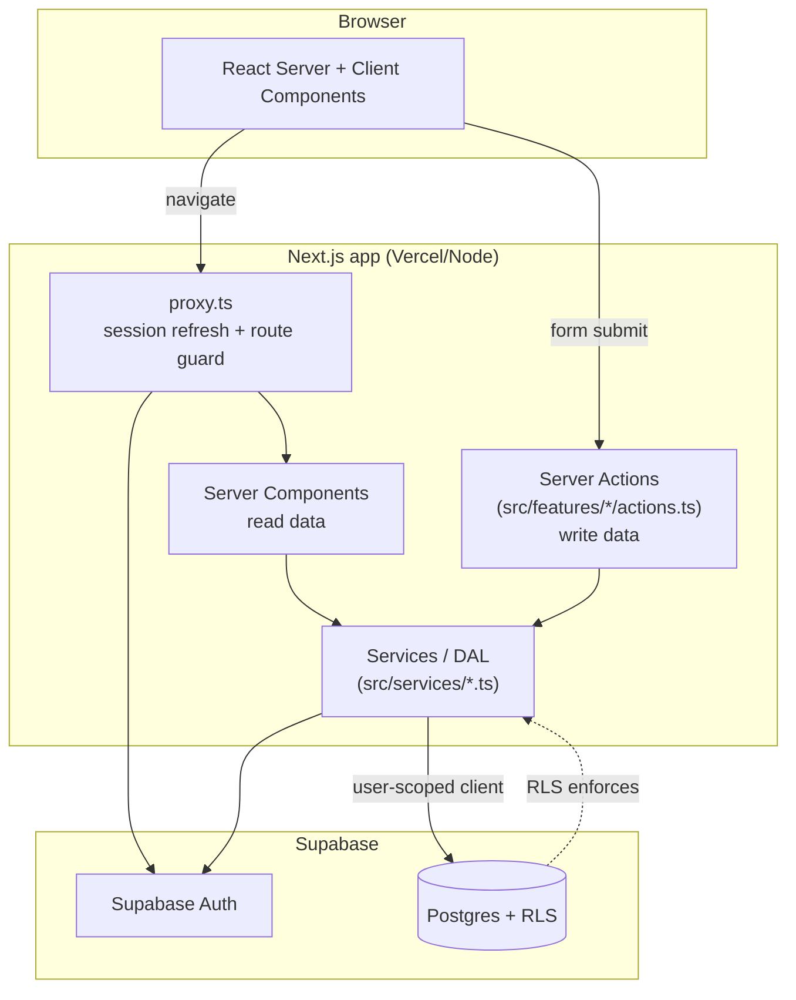

# Architecture

## Overview

DevFlow is a **modular monolith**, on purpose (see Development Rule #6 in
the project brief). One Next.js application handles UI, data access, and
mutations. There is no separate backend service yet, and none is planned
until a concrete problem (background job processing, an integration that
doesn't fit the request/response model) requires one - at which point a
worker or a NestJS service gets added deliberately, not speculatively.



Every DB read/write goes through Supabase's Postgres client using the
**signed-in user's own session**, so row-level security (see
[`docs/database.md`](./database.md)) is the actual authorization boundary
- not a check that happens to run in a Server Action. A `service_role`
client (`src/lib/supabase/admin.ts`) exists only for the handful of
operations RLS can't express (looking up a user by email to redeem an
invite, the seed script) and is explicitly `server-only`.

## Layers

```
src/
  app/            Next.js App Router routes: layouts, pages, route handlers
  features/       Feature-scoped UI (components) + Server Actions (actions.ts)
  services/       Data-access layer: typed functions wrapping Supabase queries
  components/     Shared, feature-agnostic UI (shadcn/ui primitives + small
                   composites like <PageHeader>, <EmptyState>)
  lib/            Cross-cutting utilities: Supabase client factories, zod
                   validation schemas, generic helpers
  config/         Static configuration: navigation, roles, permissions,
                   status label/color maps, env var access
  types/          Hand-written Database type (mirrors the Postgres schema)
  hooks/          Shared client-side React hooks (none needed yet)
```

The dependency direction is one-way: `app` depends on `features` and
`services`; `features` depends on `services`; `services` depends on `lib`
and `types`. Nothing in `services` or `lib` imports from `app` or
`features` - that's what keeps the data layer testable independent of
routing.

### Why `services/` *and* `features/*/actions.ts`?

- **`services/*.ts`** - pure data access. "Get project by id," "create a
  task," "log an activity event." No `redirect()`, no form parsing, no
  permission-matrix checks beyond what RLS already enforces. These are
  called from both Server Components (reads) and Server Actions (writes),
  and are wrapped in React's `cache()` where the same lookup (e.g.
  "get this project") is likely to happen more than once in a single
  request (a layout and its page both need it).
- **`features/*/actions.ts`** - the `"use server"` boundary. Parses and
  validates `FormData` with zod, checks the `can()` permission matrix,
  calls into `services/`, then handles Next.js concerns: `revalidatePath`,
  `redirect`. This is also where the UI-facing error messages live.

### Authentication

Auth uses Supabase Auth (email + password, PKCE flow for email links)
through `@supabase/ssr`. Three Supabase client factories exist for three
different execution contexts:

| File                        | Used in                                  | Key           |
| ---------------------------- | ------------------------------------------ | -------------- |
| `src/lib/supabase/client.ts`  | Client Components                          | anon key       |
| `src/lib/supabase/server.ts`  | Server Components, Server Actions, Route Handlers | anon key (user session via cookies) |
| `src/lib/supabase/admin.ts`   | Trusted server-only code (seed script, invite redemption) | service role key |

`proxy.ts` (Next.js 16's replacement for `middleware.ts`) runs on every
request, refreshes the Supabase session cookie, and redirects
unauthenticated visitors away from anything not in its public-path
allowlist. See [`src/lib/supabase/middleware.ts`](../src/lib/supabase/middleware.ts).

### Navigation and "live" vs. "preview" data

[`src/config/navigation.ts`](../src/config/navigation.ts) defines the main
sidebar and marks each section `live: true/false`. Sections not yet backed
by real data (Pull Requests, Pipelines, Deployments, Environments,
Monitoring, Incidents, AI Assistant) render realistic mock data from
[`src/lib/mock-data.ts`](../src/lib/mock-data.ts) behind a visible
"Preview data" banner, so it's never ambiguous what's real. Each of those
becomes real in its own numbered phase - see
[`docs/devops-roadmap.md`](./devops-roadmap.md).

## Why Next.js only (for now)

The brief allows introducing NestJS "later if the backend becomes
complex." Right now, everything DevFlow's backend needs to do - CRUD with
row-level security, form handling, server-rendered pages - is a good fit
for Next.js Server Actions and Route Handlers. Introducing a second
service today would mean running two deployables, two auth
configurations, and a network hop, to solve a problem DevFlow doesn't have
yet. The trigger for adding NestJS (or a background worker) will be a
concrete need: a job that must run outside the request/response cycle
(webhook processing queues in Phase 4, CI-triggered work in Phase 7) - not
a preference for having "a backend."
