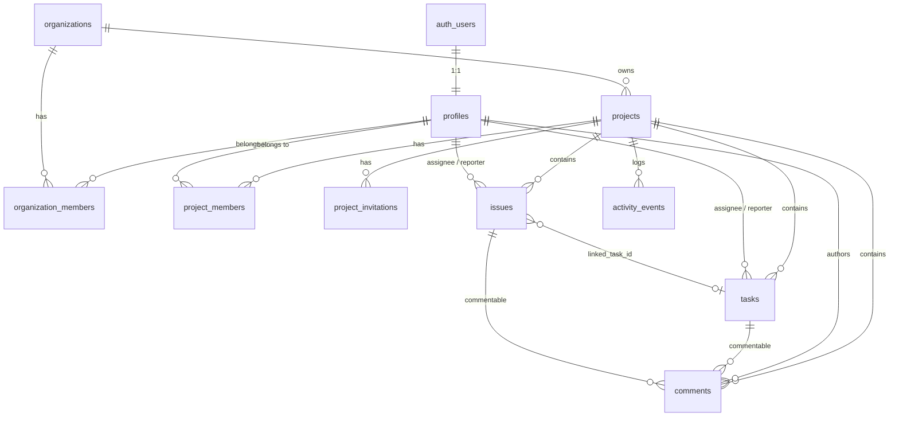

# Database

DevFlow uses **PostgreSQL via Supabase**. Supabase gives us managed Postgres,
authentication (`auth.users`), and a JS client that respects row-level
security (RLS) - which is what lets the Next.js app talk to the database
directly from Server Components and Server Actions without a separate API
layer, while still enforcing permissions correctly.

## Entity-relationship overview



## Tables

| Table                   | Purpose                                                                 |
| ------------------------ | ------------------------------------------------------------------------ |
| `profiles`               | Public-facing user data, one row per `auth.users` row (auto-created by a trigger on signup). |
| `organizations`           | Top-level tenant. Holds projects and members.                            |
| `organization_members`    | Join table: user &harr; organization, with an `app_role`.                |
| `projects`                 | Belongs to an organization. Name, description, repo URL, tech stack, status. |
| `project_members`          | Join table: user &harr; project, with an `app_role`. A user can hold a different role per project than their org-level role. |
| `project_invitations`      | Pending invite by email for someone without a DevFlow account yet. Redeemed automatically on signup. |
| `tasks`                     | Kanban-style work items. Status, priority, labels, assignee, due date.   |
| `issues`                     | Bugs/defects. Status, priority, optionally linked to a task.             |
| `comments`                   | Polymorphic: attached to a `task` or an `issue` via `commentable_type`/`commentable_id`. |
| `activity_events`             | Append-only feed. Every mutating action writes one row here (see below). |
| `task_attachments`             | Metadata for files attached to a task (Phase 2). The actual file bytes live in the private `task-attachments` Storage bucket. |

Migrations live in [`database/migrations/`](../database/migrations/),
numbered and applied in order. Each file is commented inline with what it
does and why.

## Role-based access control

There is a single `app_role` enum, reused at both the organization and
project level:

```
administrator | project_owner | developer | reviewer | lecturer
```

- **`administrator`** at the organization level has full control of that
  org: manage members, create/update/delete every project in it. This is
  the *org-admin bypass*: a user doesn't need an explicit `project_members`
  row to manage a project if they're an org administrator.
- **`project_owner` / `developer` / `reviewer` / `lecturer`** are typically
  project-level roles: a user is added to a specific `project_members` row
  with one of these roles, which governs what they can do on *that*
  project only. See [`src/config/roles.ts`](../src/config/roles.ts) for the
  human-readable labels/descriptions and
  [`src/config/permissions.ts`](../src/config/permissions.ts) for the
  permission matrix.

This two-table (org + project) role model, rather than one global role per
user, is what lets a lecturer be a read-mostly observer on one project and
a developer on another - a real scenario for the "students + lecturer"
use case DevFlow is built for.

**Design decision:** permissions are enforced in two places that must
agree:

1. **Postgres RLS policies** (`database/migrations/`) - the actual
   security boundary. This holds even if a bug in application code
   forgets a permission check.
2. **`src/config/permissions.ts`** - a plain TypeScript matrix, used by the
   UI to show/hide actions and by Server Actions to fail fast with a clear
   error before ever hitting the database.

We deliberately did **not** build a dynamic, database-driven permissions
table (a `permissions` table with rows checked at runtime). Five fixed
roles cover the product spec, and a code-level matrix is far simpler to
read, test, and reason about than a fully dynamic ACL system. Revisit this
if DevFlow ever needs custom, org-defined roles.

RLS relies on a handful of `SECURITY DEFINER` SQL helper functions
(`is_org_member`, `is_org_admin`, `is_project_member`, `is_project_admin`,
`get_project_role`, ...) defined in the migrations. They exist so policies
can check membership on `organization_members`/`project_members` without
triggering RLS recursion on those same tables.

## Activity feed

`activity_events` is written to by every mutating function in
`src/services/*.ts` (see `src/services/activity.ts`). It's the backbone of
the project Activity page (Phase 1/3) and, later, the audit log and AI
assistant's data source. Rows are append-only - there's no UPDATE or
DELETE policy - so the feed can't be edited after the fact.

## File storage (task attachments)

Migration `0008_task_attachments.sql` creates a private Supabase Storage
bucket (`task-attachments`) alongside the `task_attachments` metadata
table. Files are stored at `<project_id>/<task_id>/<uuid>-<filename>`, and
the bucket's RLS policies (on `storage.objects`) check project membership
straight from that path via `storage.foldername(name)` - no extra lookup
table needed. Because the bucket is private, every download goes through
a freshly generated short-lived signed URL
(`src/services/attachments.ts`'s `getAttachmentDownloadUrl`) rather than a
public URL.

## Applying migrations

Until Terraform/CI manage this (later phases), apply migrations by hand
against your Supabase project, in numeric order:

```bash
# Using the Supabase CLI (recommended)
supabase link --project-ref <your-project-ref>
for f in database/migrations/*.sql; do
  psql "$DATABASE_URL" -f "$f"
done

# Or paste each file's contents into the Supabase SQL Editor, in order.
```

## Types

[`src/types/database.ts`](../src/types/database.ts) is a hand-written
mirror of this schema, shaped exactly like `supabase gen types typescript`
output (including `Relationships` on every table - `@supabase/postgrest-js`
silently falls back to untyped `never` queries if that shape doesn't
match). Once a real Supabase project exists, regenerate it for real:

```bash
supabase gen types typescript --project-id <id> > src/types/database.ts
```

and keep it in sync with `database/migrations/` from then on.

## Seed data

[`database/seed/seed.ts`](../database/seed/seed.ts) creates one demo user
per role, a demo organization, two projects, and sample tasks/issues/
comments/activity. See
[`database/seed/README.md`](../database/seed/README.md) for how to run it.
