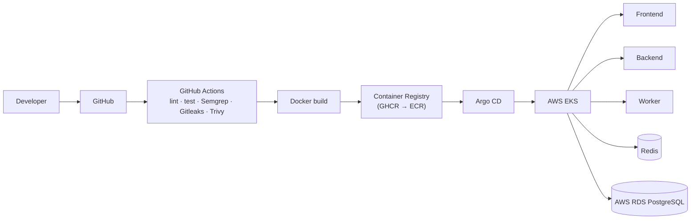

# Deployment

## Current state (Phase 1)

DevFlow isn't deployed anywhere yet - it runs locally against a Supabase
cloud project (managed Postgres + Auth). There's no CI/CD, no container
image, and no hosting decision made beyond "the app needs Node.js hosting
that supports Next.js Server Actions and Route Handlers."

## Roadmap

Deployment infrastructure is introduced gradually, in the order below.
Each phase is documented in detail as it's built - see
[`docs/devops-roadmap.md`](./devops-roadmap.md) for the "what problem /
why / how" writeup of each one as it lands.

| Phase | Adds                                                          |
| ------ | ---------------------------------------------------------------- |
| 6      | Docker image + Compose for local Postgres/Redis                    |
| 7      | GitHub Actions CI (lint, type-check, test, build)                    |
| 8      | Security scanning in the pipeline (Trivy, Semgrep, Gitleaks)          |
| 9      | Container images published to GitHub Container Registry, later ECR      |
| 10     | Development / Staging / Production environments with deployment history and Production approval gates |
| 11     | First manual deployment to AWS (a simple architecture: IAM, VPC, ECR, RDS, CloudWatch, S3) |
| 12     | That AWS infrastructure replaced with Terraform                         |
| 13     | Kubernetes locally (Kind/Minikube), once Docker fundamentals are solid   |
| 14     | Production workload moved to AWS EKS                                   |
| 17     | GitOps with Argo CD (Git as the source of truth for what's deployed)     |

## Target architecture

## Environment variables required to deploy

See [`.env.example`](../.env.example) for the full, current list. At
minimum, any deployment target needs `NEXT_PUBLIC_SUPABASE_URL`,
`NEXT_PUBLIC_SUPABASE_ANON_KEY`, `SUPABASE_SERVICE_ROLE_KEY`, and
`NEXT_PUBLIC_SITE_URL` set to the real deployed origin (so auth email
redirect links point at the right place).

## Why not deploy something today?

The brief is explicit about not skipping phases (Development Rule #1) and
not reaching for Kubernetes/Terraform/EKS before their prerequisites are
understood (Rules #2-4). A quick Vercel/Netlify deploy would technically
"work" for the Next.js app alone, but it would sidestep the Docker → CI →
security → AWS → Terraform → Kubernetes progression that's the actual
point of this project, and it would leave `docs/devops-roadmap.md` with
nothing real to document for those phases. Deployment starts for real in
Phase 6.
